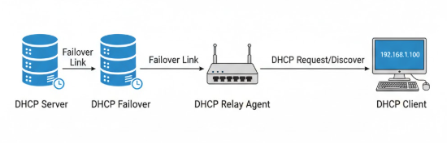

# Configuración ISC DHCP & Failover & Relay

---

## Índice
### [Pasos Previos](vbox.md)
### [Configuración Red Estática](static.md)
### [Configuración Servidor & Failover](servidor.md)
### [Configuración Agente Relay](relay.md)
### [El Cliente DHCP](cliente.md)
